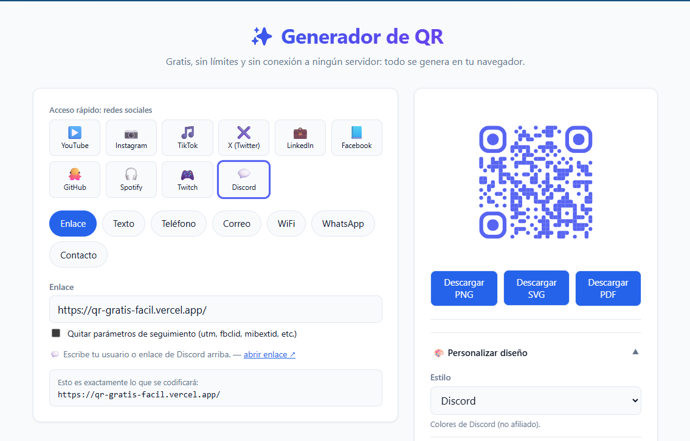

# QR Generator

**[Pruébalo en vivo → qr-gratis-facil.vercel.app](https://qr-gratis-facil.vercel.app)**

Generador de códigos QR **gratuito, sin límites y open source**. Corre 100% en el navegador: nada del contenido que capturas (enlaces, WiFi, contactos, etc.) se envía a ningún servidor.

Nace de una mala experiencia con generadores de QR de paga que fallaron sin aviso. El objetivo es tener una alternativa simple, confiable y auditable para toda la comunidad.

Los requerimientos completos del proyecto (funcionales, técnicos y de alcance) están en [`requisitos.md`](./requisitos.md).

<!--
  Sugerencia: agrega aquí una captura de pantalla o un GIF corto del flujo
  (elegir tipo de contenido → personalizar → descargar), por ejemplo:
  
-->

## Características

- Generación de QR para **URL, texto, teléfono, email, WiFi, WhatsApp y vCard** (tarjeta de contacto).
- Selector rápido de **plantillas por red social** (Instagram, TikTok, X, LinkedIn, Facebook, GitHub, Spotify, Twitch, Discord, YouTube), con colores propios sin usar logos oficiales.
- Personalización de colores, degradados, forma de los módulos, nivel de corrección de errores y **logo central**.
- Descarga en **PNG, SVG y PDF**, sin marcas de agua.
- Sin cuentas, sin backend, sin rastreo del contenido que generas.
- Guías de uso indexables: [QR para WiFi](https://qr-gratis-facil.vercel.app/guias/qr-wifi/), [QR para WhatsApp Business](https://qr-gratis-facil.vercel.app/guias/qr-whatsapp-business/), [QR vCard / tarjeta digital](https://qr-gratis-facil.vercel.app/guias/qr-vcard-tarjeta-digital/).

## Stack

- [React](https://react.dev/) + [TypeScript](https://www.typescriptlang.org/) + [Vite](https://vite.dev/)
- [qr-code-styling](https://github.com/kozakdenys/qr-code-styling) para la generación del QR en el cliente
- [jsPDF](https://github.com/parallax/jsPDF) para la exportación a PDF (se carga solo cuando se usa)
- [Vercel Web Analytics](https://vercel.com/docs/analytics) (sin cookies) para medir tráfico agregado — ver [`/privacidad`](https://qr-gratis-facil.vercel.app/privacidad/)

## Desarrollo local (self-hosting)

Requisitos: Node.js 20+ y npm.

```bash
git clone https://github.com/JuanCarlosJimenezRoman/qr-generator.git
cd qr-generator
npm install
npm run dev
```

Abre la URL que muestra Vite en la terminal (por defecto `http://localhost:5173`).

### Otros scripts

```bash
npm run build    # build de producción (incluye la app y las páginas /guias y /privacidad)
npm run preview  # sirve el build de producción localmente
npm run lint     # linting con oxlint
npm test         # pruebas unitarias con vitest
```

### Desplegar tu propia copia

El proyecto es un sitio 100% estático (sin variables de entorno ni backend), así que se despliega en cualquier hosting estático. Con [Vercel](https://vercel.com/) basta con importar el repo: detecta Vite automáticamente y el comando de build ya está configurado en `package.json`.

## Flujo de ramas

- `main`: siempre estable, refleja lo desplegado.
- `develop`: rama de trabajo activa; las nuevas funciones se integran aquí antes de pasar a `main`.

## Contribuir

Este proyecto es open source y las contribuciones son bienvenidas. Antes de abrir un PR grande, abre un issue para platicar el enfoque.

## Licencia

[MIT](./LICENSE)
